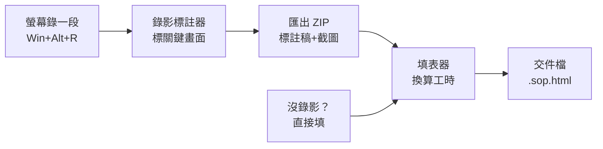
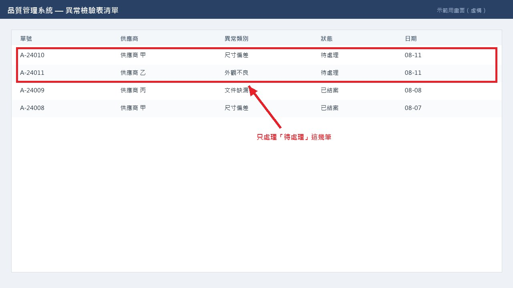
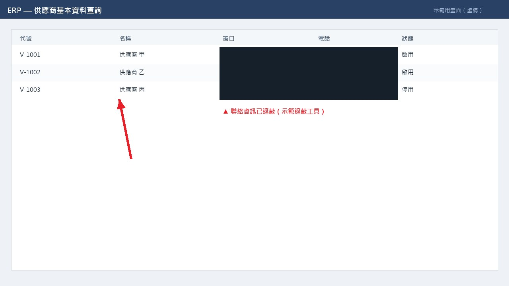

# SOP 流程盤點工具組

把「一條天天在做、但沒人寫下來的流程」變成主管看得懂的交件檔 ——
**現況 vs AI 導入後的工時對照**。

兩個單檔 HTML，**雙擊就能用**。不用安裝、不用連網、不用帳號。
影片和截圖從頭到尾都留在你自己的電腦上，不會上傳到任何地方。

---

## 兩個工具

| 工具 | 做什麼 |
|------|--------|
| **[SOP 錄影標註器](tools/SOP標註器.html)** | 把螢幕錄影變成有順序、有截圖、有說明的步驟清單。播到關鍵畫面按一下、寫一句在幹嘛，可以在截圖上畫箭頭／框選／遮蔽敏感資料 |
| **[SOP 工時盤點填表器](tools/SOP填表器.html)** | 把步驟換算成工時，填「現況」與「AI 導入後」兩條流程，產出交件檔 `.sop.html` |

> **下載方式**：右上角 **Code → Download ZIP**，解壓縮後打開 `tools/` 裡的兩個 `.html`。
> 直接點上面的連結會看到原始碼，不是打開工具。

---

## 怎麼用



### 有螢幕操作 → 先錄影

1. `Win` + `Alt` + `R` 錄一遍你平常怎麼做（**錄一件就好**，不用錄一整天）
2. 打開 `tools/SOP標註器.html`，把影片拖進去
3. 播到每個「換了系統、換了工具」的地方按 <kbd>M</kbd>，在左邊寫一句在幹嘛
4. 要指重點就點縮圖 —— 箭頭、手指、游標、編號、框選都有；**有客戶名稱或報價就用「遮蔽」蓋掉**
5. 右上角「輸出給 AI」→「下載 ZIP」

標三到八刀就夠了。判準是**換了工具或換了系統就是新的一步**。

### 沒有螢幕操作 → 直接填表

打開 `tools/SOP填表器.html`，一步一步填。截圖可以直接 <kbd>Ctrl</kbd>+<kbd>V</kbd> 貼上。

---

## 工時怎麼算

每個步驟讀起來就是一句話：

> 每件 **`dur`** 秒/分/小時，共 **`qty`** 件，每 **`every`** 個 **`freq`** 一次，**`hc`** 人處理。

```
月人時 = 每件秒數 × 件數 × 人數 × (該週期每月次數 ÷ every) ÷ 3600
月次數：日 20.8、週 4.33、月 1、季 1/3、年 1/12
```

**最常見的錯誤是件數。** 「一天花 2 小時做這件事」要填 `dur=2小時, qty=1`，
不是 `dur=2小時, qty=176` —— 後者會讓工時暴增幾百倍。
算出來的數字如果跟體感差很多，先檢查件數，不是公式。

---

## 範例

| 檔案 | 說明 |
|------|------|
| [`examples/範例成品_品保部.sop.html`](examples/) | 完整交件檔，看得到現況／AI 後的工時對照怎麼呈現 |
| [`examples/示範_含截圖.sop.html`](examples/) | 帶截圖的版本 |
| [`examples/檢驗表稽核_示範錄影_標註/`](examples/) | 標註器匯出的資料夾長什麼樣：`標註稿.md` + `marks.json` + `shots/` |

範例標註資料夾裡的截圖示範了三種標記：





> 範例畫面全部是虛構的，不對應任何真實系統或供應商。

---

## 給 AI 用

標註器匯出的資料夾是**寫給 AI 讀的**。`標註稿.md` 開頭就內建一段說明，
告訴 AI 怎麼解讀順序、耗時、以及截圖上的標記（框選＝重點、黑塊＝刻意遮蔽、
裁切圖＝只留了一部分），還會提醒它：

> 錄影只錄得到「做一件的樣子」。一天做幾件、多久做一次、幾個人做，
> 錄影裡看不出來，一定要另外問使用者。

把資料夾丟給 Claude 之類的助理，說「幫我把這份標註做成 SOP」就會接手。

---

## 環境需求

- **Chrome 或 Edge**（標註器用到 `requestVideoFrameCallback` 才能讓截圖和時間戳對得起來）
- 影片格式：mp4 / webm / mov，Windows 內建錄影（`Win`+`Alt`+`R`）的檔案可直接用
- 純前端，無後端、無外部連線

## 注意

送出交件檔之前**先看一眼截圖**。裡面是內部系統畫面，可能帶客戶名稱、料號、
報價或個資 —— 不該外流的地方回標註器用「遮蔽」蓋掉再匯出一次。
